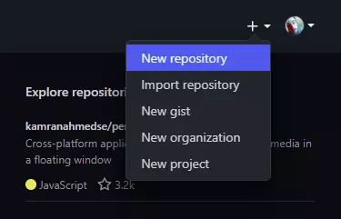
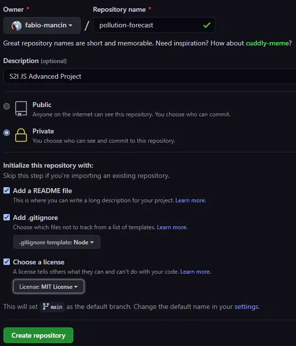
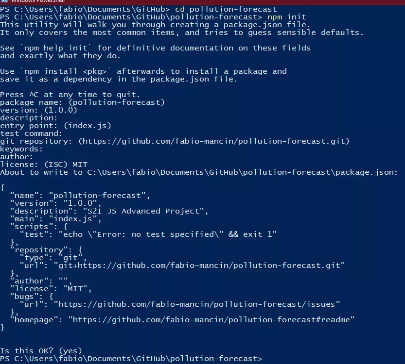
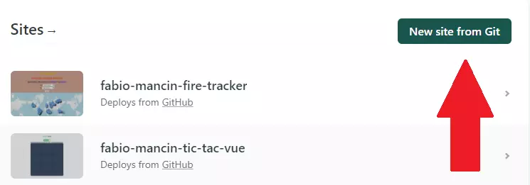
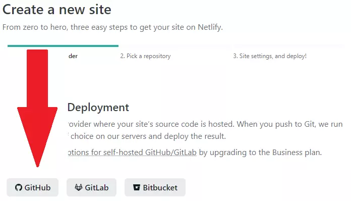
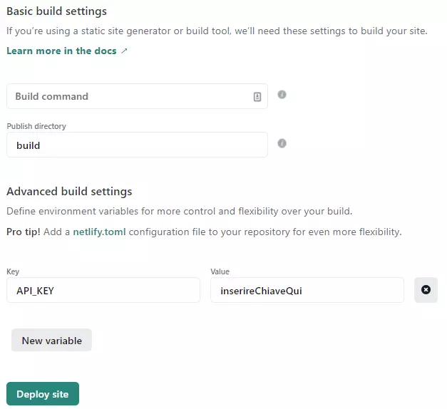
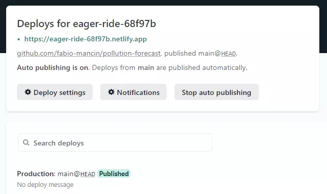

# Start2Impact: Javascript Advanced Project Survival Guide

## Disclaimer

Non mosterò intenzionalmente ogni singola riga di codice necessaria a svolgere il progetto: lo sviluppo software é fatto in buona parte di **ricerca, studio e processo di trial and error.**

Suggerisco di non copiare ed incollare il codice fornito senza guardarlo: sì, può funzionare, ma non si impara nulla. Anzi se qualcosa non vi è chiaro andate subito su Google e troverete decine di risorse per approfondire quell'argomento!

C'è un muro davvero alto fra la semplicità dei tre file HTML, CSS e JS ed il mondo di versionamento, variabili d'ambiente, bundlers, deployment.

Ho scritto questa guida per facilitare la fase di preparazione che sta fra lo studio della Super Guida e lo svolgimento pratico del progetto riunendo le nozioni di base che ho visto creavano più dubbi (Node, Git, WebPack, Environment Variables, Netlify) in modo ordinato ed estremamente semplificato, in quanto la documentazione ufficiale di quegli strumenti è così vasta che diventa ostica da approcciare per chi si sta avvicinando soltanto ora al mondo della programmazione; ciò nonostante questa non vuole diventare una scusa per non studiare: invito tutti ad approfondire il più possibile gli argomenti e cercare di capire tutto ciò che si fa.

**I FILE CONTENUTI IN QUESTO REPOSITORY SONO QUELLI CHE SPIEGO NELLA GUIDA!**

Un'ultima nota prima di iniziare: troverete errori ed imprecisioni e conto su di voi e sul vostro feedback per la correzione; inoltre esistono sicuramente modi migliori per arrivare allo stesso risultato finale, ma con le mie limitatissime conoscenze attuali questo è il meglio che riesco a fare. Sono apertissimo ad imparare cose nuove, quindi se qualcuno ha idee me lo dica! I miei contatti sono in fondo alla guida.

---

## Table of contents

- [Start2Impact: Javascript Advanced Project Survival Guide](#start2impact-javascript-advanced-project-survival-guide)
  - [Disclaimer](#disclaimer)
  - [Table of contents](#table-of-contents)
  - [Prerequisiti](#prerequisiti)
  - [Temi](#temi)
    - [WebPack](#webpack)
    - [Environment Variables](#environment-variables)
    - [API e chiamate asincrone](#api-e-chiamate-asincrone)
    - [Deployment](#deployment)
  - [Configurazione iniziale](#configurazione-iniziale)
  - [Ambienti di sviluppo](#ambienti-di-sviluppo)
    - [webpack.config.js](#webpackconfigjs)
    - [package.json](#packagejson)
  - [Chiamata alle API](#chiamata-alle-api)
  - [Environment Variables to the rescue](#environment-variables-to-the-rescue)
  - [JavaScript ha fretta](#javascript-ha-fretta)
  - [Live demo dilemma](#live-demo-dilemma)
  - [That's all folks](#thats-all-folks)

## Prerequisiti

- [Account su GitHub](https://github.com/)
  - Abbiamo bisogno di GitHub per mostrare il codice sorgente ed utilizzare il continuous deployment di Netlify.
- [GitHub CLI](https://github.com/cli/cli)
  - In alternativa [GitHub Desktop](https://desktop.github.com/). Io userò la CLI nella guida.
- [NodeJS](https://nodejs.org/en/)
  - Node ci permette di avere accesso ad [NPM](https://npmjs.com/) ed agli script necessari al development e deployment.
- [Account su Netlify](https://netlify.com)
  - Useremo Netlify per deployare il progetto; si può fare anche con altre piattaforme (ad esempio Firebase) ma il processo sarà differente. Su Netlify tutte le funzionalità che utilizzeremo sono disponibili **gratuitamente**.

---

## Temi

### WebPack

> WebPack è un bundler: un software che prende i file che vengono creati e le librerie che vengono utilizzate, ne ottimizza il codice e riunisce il tutto in un solo file che si può mettere online. Nella pratica noi creeremo un file _index.js_ che può dipendere anche da librerie esterne (axios, lodash); quello che verrà messo online nella demo, però, sarà un unico file _bundle.js_ che contiene tutto quanto. Ci permette anche di usare configurazioni diverse in base alla necessità: se stiamo sviluppando e facendo test useremo una configurazione, mentre per la versione finale che verrà messa online ne useremo un'altra.
> Per una guida più estensiva di WebPack vi rimando a quella di `@pablomicheletti#6410`, pubblicata su Discord!

### Environment Variables

> Nel progetto è richiesto di utilizzare una chiave API, cioè un token univoco che permette di accedere ai dati del server. Queste chiavi sono private ed assolutamente da tenere nascoste: non si possono pubblicare su GitHub nè lasciare che traspaiano dalla demo del sito che metteremo online.
> Per farlo in locale useremo una libreria chiamata **webpack-dotenv**, mentre per la demo ci affideremo a delle particolari funzioni messe a disposizione da Netlify.

### API e chiamate asincrone

> JavaScript ha fretta: non aspetta che una funzione abbia finito di fare il suo dovere prima di eseguire quella successiva, quindi se la seconda dipende dal risultato della prima l'applicazione non funziona. Esempio: funzione A si aspetta una serie di dati, quindi li va a cercare; funzione B utilizza quei dati ma non aspetta che A abbia finito di cercare, quindi usa una variabile vuota.. Non riuscendo a far nulla. Dobbiamo imparare a far star tranquillo JS con funzioni chiamate asincrone, cioè che aspettano qualcosa prima di continuare. **Axios** è una libreria che ci può aiutare ad eseguire le chiamate a risorse esterne con scioltezza, ma in questa guida non la utilizzerò.

### Deployment

> Nel progetto è richiesta una live demo: impareremo a crearne una su Netlify.

---

## Configurazione iniziale

Per prima cosa dritti su GitHub a creare un repository dal menu in alto a destra.



- Nome a piacere
- Descrizione opzionale ma consigliata
- Per il momento repository privato, a fine progetto verrà cambiato in pubblico
- Aggiungere README :white_check_mark:
- Aggiungere gitignore con template Node:white_check_mark:
- Licenza MIT :white_check_mark:



Andate nella cartella dove volete inizializzare il progetto ed aprite una CLI in quella posizione.

- `gh auth login`
  - Per loggarsi con il proprio profilo GitHub permettendo l'accesso ai repository
- `gh repo clone nome-utente/nome-repository`
  - Per scaricare i file creati da GitHub durante la configurazione del repo e poterli usare in locale
- `cd nome-repository`
  - Per spostarsi nella cartella appena creata
- `npm init`
  - Procedura guidata che creerà un file package.json, che servirà a Node per gestire i moduli del progetto e gli script che verranno utilizzati da WebPack.
- `npm install webpack webpack-cli dotenv-webpack html-webpack-plugin webpack-dev-server --save-dev`
  - NPM installerà i moduli che ci servono durante lo sviluppo (notare il comando _--save-dev_ alla fine della riga)



Successivamente creeremo delle cartelle e file che useremo più tardi: fatelo subito e ne spiegherò l'uso quando diverranno necessari.
I file da creare sono i seguenti (li riempiremo più tardi):

- `lambda.js` dentro a `netlify/functions`
- `index.js`, `index_dev.js` e `index.html` in `src`
- `.env`
- `.env.example`
- `netlify.toml`

Nel file `index.html` mettiamo una struttura di base HTML5:

```html
<!DOCTYPE html>
<html>
  <head>
    <meta charset="utf-8" />
    <!-- Con questa riga htmlWebpackPlugin sostituisce il titolo del file con quello specificato in webpack.config.js - lo faremo fra poco! -->
    <title><%= htmlWebpackPlugin.options.title %></title>
    <!-- Questo è un placeholder per favicon.ico, ricordate di metterne uno decente prima di inviare il progetto :P -->
    <link
      href="data:image/x-icon;base64,AAABAAEAEBAQAAEABAAoAQAAFgAAACgAAAAQAAAAIAAAAAEABAAAAAAAgAAAAAAAAAAAAAAAEAAAAAAAAAAAAAAA/4QAAAAAAAAAAAAAAAAAAAAAAAAAAAAAAAAAAAAAAAAAAAAAAAAAAAAAAAAAAAAAAAAAAAAAAAAAAAAAERERERERERERAAAAAAAAERAQAAAAAAEBEAEAAAAAEAEQABAAAAEAARAAAQAAEAABEAAAEAEAAAEQAAABEAAAARAAAAEQAAABEAAAEAEAAAEQAAEAABAAARAAEAAAAQABEAEAAAAAEAEQEAAAAAABAREAAAAAAAAREREREREREREAAAAAP/wAAF/6AABv9gAAd+4AAHveAAB9vgAAfn4AAH5+AAB9vgAAe94AAHfuAABv9gAAX/oAAD/8AAAAAAAA"
      rel="icon"
      type="image/x-icon"
    />
  </head>
  <body>
    <div id="wrapper"></div>
  </body>
</html>
```

A fine procedimento la struttura della cartella sarà la seguente:

📦repository-name  
 ┣ 📂\.**_git_**  
 ┃ ┣ **_[...]_**  
 ┣ 📂netlify <>  
 ┃ ┣ 📂functions <>  
 ┃ ┃ ┣ lambda.js <>  
 ┣ 📂**_node_modules_**  
 ┃ ┣ **_[...]_**  
 ┣ 📂src <>  
 ┃ ┣ 📜index.html <>  
 ┃ ┣ 📜index.js <>  
 ┃ ┗ 📜index_dev.js <>  
 ┣ 📜\.env <>  
 ┣ 📜\.env.example <>  
 ┣ 📜\.**_gitignore_**  
 ┣ 📜**_LICENSE_**  
 ┣ 📜netlify.toml <>  
 ┣ 📜**_package-lock.json_**  
 ┣ 📜**_package.json_**  
 ┣ 📜**_README.md_**  
 ┗ 📜webpack.config.js <>

\*File e cartelle in **_grassetto_** vengono generati automaticamente e quindi **per ora** non vanno toccati!\*

_Quelli contrassegnati da <> finale invece vanno creati ora._

---

## Ambienti di sviluppo

Come anticipato, dovremo usare una configurazione per la fase di sviluppo (_development_) ed un'altra per la fase di produzione (_production_).

WebPack, propriamente configurato, ci aiuterà in questo compito.  
**Prestate attenzione ai commenti, spiegano cosa sta succedendo!**  
Nel file `webpack.config.js` che abbiamo appena creato nella cartella principale del progetto, la stessa di `package.json`, scriviamo:

### webpack.config.js

```javascript
// Plugin che ci permette di utilizzare un template nel codice sorgente e ottimizzarlo per la versione che andrà online
const HtmlWebpackPlugin = require("html-webpack-plugin");
// Libreria che ci permette di utilizzare le Environment Variables durante lo sviluppo locale
const Dotenv = require("dotenv-webpack");
// Modulo di NodeJS che dà la possibilità di interagire con file e cartelle locali
const path = require("path");

// Per permettere a WebPack di utilizzare gli argomenti il modulo deve essere una funzione (normalmente è un oggetto)
module.exports = (env, argv) => {
  // FONDAMENTALE! Definiamo il file da utilizzare in base all'ambiente
  // Se WebPack vede che siamo in sviluppo andrà ad utilizzare './src/index_dev.js'
  // Se invece saremo in produzione utilizzerà './src/index.js'
  const entryPath =
    argv.mode === "development" ? "./src/index_dev.js" : "./src/index.js";
  return {
    entry: {
      // Qui specifichiamo il file di ENTRATA, vedi commento sopra
      main: path.resolve(__dirname, entryPath),
    },
    output: {
      // Una volta creato un pacchetto WebPack metterà i file risultanti nella cartella build
      filename: "[name].bundle.js",
      path: path.resolve(__dirname, "build"),
    },
    // Configurazione di un plugin, necessario per sveltire il processo di sviluppo vedi asterischi nello snippet successivo **
    devServer: {
      static: "./build",
      open: true,
    },
    plugins: [
      // Plugin che prende un template e lo personalizza, completandolo con scripts ed eventuali stili
      new HtmlWebpackPlugin({
        title: "Pollution Forecast",
        template: path.resolve(__dirname, "./src/index.html"),
      }),
      // Qui dotenv-webpack viene inizializzato
      new Dotenv(),
    ],
  };
};
```

### package.json

Successivamente configuriamo Node dal file `package.json` per eseguire alcuni script necessari: la maggioranza del file è stata generata automaticamente quando abbiamo eseguito `npm init`; la parte commentata mostra cosa dobbiamo cambiare:

```javascript
{
  "name": "s2i-js-advanced-survival-guide",
  "version": "1.0.0",
  "description": "S2I JS Advanced Project",
  "main": "index.js",
  // La sezione scripts va modificata per usare le funzionalità di webpack
  "scripts": {
    "test": "echo \"Error: no test specified\" && exit 1",
    // Quando viene lanciato il comando npm run dev webpack fa partire il plugin dev server in modalità sviluppo
    // vedi commento nello snippet sopra **
    "dev": "webpack serve --mode development",
    // Mentre in modalità produzione viene ottimizzato e impacchettato il codice
    "build": "webpack --mode production"
  },
  "repository": {
    "type": "git",
    "url": "git+https://github.com/fabio-mancin/s2i-js-advanced-survival-guide.git"
  },
  "author": "",
  "license": "MIT",
  "bugs": {
    "url": "https://github.com/fabio-mancin/s2i-js-advanced-survival-guide/issues"
  },
  "homepage": "https://github.com/fabio-mancin/s2i-js-advanced-survival-guide#readme",
  "devDependencies": {
    "dotenv-webpack": "^7.0.2",
    "html-webpack-plugin": "^5.3.1",
    "webpack": "^5.26.3",
    "webpack-cli": "^4.5.0",
    "webpack-dev-server": "^3.11.2"
  }
}
```

**La prima parte è andata!**
Ora abbiamo due modalità disponibili - sviluppo e produzione! Da riga di comando:

- `npm run dev`

  - Fa partire un Live Server nel browser che si aggiorna ad ogni cambiamento che facciamo nei file, perfetto per lo sviluppo!
  - In questa modalità viene utilizzato il file `index_dev.js`. Provate a scriverci dentro lo snippet sotto e vedrete il browser aggiornarsi e far partire un fastidiosissimo alert ed un messaggio nella console.

  ```javascript
  // index_dev.js

  alert("Ora sembra tutto un casino ma alla fine sarà più chiaro.. spero!");
  console.info("Va bene Fabio, se lo dici tu..");
  ```

- `npm run build`
  - Crea un bundle e lo piazza in `/build`.
  - Questa parte la farà principalmente Netlify, in quanto lo istruiremo più tardi per eseguire quel comando e poi mettere online il contenuto di quella cartella.

---

## Chiamata alle API

Ora le cose si fanno più interessanti e 'tangibili'.

Le **Application Programming Interfaces** spiegate nei termini più terra-terra possibili sono dei metodi messi a disposizione da qualcuno (nel nostro caso un ente internazionale di controllo dell'inquinamento dell'aria) per dare accesso ai propri dati.

Alcune API sono interamente libere (ad esempio [Star Wars API](https://swapi.dev/)) ed ottime per fare pratica; alcune hanno un modello su abbonamento ([Flight API](https://www.flightapi.io/)) in cui più si paga più frequentemente si possono richiedere dati o si ha accesso a dati ulteriori; altre ancora, come quella che useremo noi, sono di libero accesso ma limitano il numero di richieste inviabili dallo stesso client per evitare abusi e congestioni.

La maggioranza comunque fornisce una chiave, la famigerata API KEY, che permette di identificare il richiedente ed applicare eventuali limitazioni o privilegi. La chiave che andremo a richiedere noi è gratuita quindi nel caso venisse diffusa non ci sarebbero chissà che problemi, ma questi progetti sono fatti apposta per imparare senza "rischi" a gestire situazioni reali, quindi impareremo prima ad usare la chiave in locale e poi come utilizzarla in un sito reale senza diffonderla.

Prima di tutto la chiave va richiesta da [questa pagina di AQICN](https://aqicn.org/data-platform/token/#/); arriverà via mail una stringa di numeri e lettere. La utilizzeremo poi per ottenere i dati dai server di AQICN.

La prima e giusta idea che salta alla mente sarebbe semplicemente di piazzare la chiave in una variabile ed utilizzarla, tipo

```javascript
const API_KEY = "stringaDiNumeriELettere";
// fare cose con API_KEY
console.log(API_KEY);
```

funziona perfettamente, ma questo esporrebbe la chiave in due modi:

- Su GitHub, dato che il codice sorgente andrà messo pubblicamente online in modo che il coach (ed un eventuale datore di lavoro in futuro!) possano valutarlo.
- Anche dopo aver impacchettato il file con WebPack (`npm run build`) la chiave sarebbe visibile nel bundle .js! Per quanto il file sia stato minificato (e quindi di difficile lettura per un umano), qualsiasi bot basilare potrebbe parsare quel file in centesimi di secondo e rubare la chiave; inoltre esistono script che fanno il processo di minificazione al contrario, quindi fanno tornare leggibili file minificati. Insomma, **IL BUNDLE NON E' ASSOLUTAMENTE UN MODO PER NASCONDERE I DATI SENSIBILI, E NON E' PENSATO PER ESSERLO!**
- Nella versione live del sito, semplicemente dai Dev Tool tramite i quali si possono ispezionare tutti i file che compongono un sito e le richieste che arrivano da esso.

Per fortuna abbiamo gli strumenti (e la guida :P) per gestire questo problema!

---

## Environment Variables to the rescue

Nasconderemo la key nell'ambiente di sviluppo stesso.
Date un'occhiata al file `.gitignore`: è stato pregenerato da GitHub quando abbiamo inizializzato il repository, e consiste in una lista di regole che dicono a GitHub: "Quando pubblicherai questo progetto _SALTA_ questi tipi di file/cartelle, sono privati!".

Fra di essi, scorrendo, vedrete scritto `.env`: il file dove inseriremo la nostra key e che non verrà messo online più tardi per salvarla.

Già che siamo qui, aggiungiamo a fine file la riga

```javascript
.netlify/
```

..non sono necessarie ma è una misura di sicurezza aggiuntiva. Sono un po' paranoico.

Chiudiamo `.gitignore` ed apriamo `.env`, al cui interno andremo a scrivere soltanto:  
`API_KEY = inserireLaVostraApiKeyQui`

Ora la magia fatta dal plugin `webpack-dotenv`: in `webpack.config.js` abbiamo dichiarato

```javascript
// ...
plugins: [
  // ...
  // Qui dotenv-webpack viene inizializzato
  new Dotenv(),
];
// ...
```

Quella semplice riga mette a disposizione la variabile che si trova in `.env` in tutta l'applicazione come variabile d'ambiente a cui si accede molto semplicemente..

```javascript
// ..così!
const API_KEY = process.env.API_KEY;
```

Quindi quando qualcuno (il coach!) scaricherà il vostro codice sorgente per provarlo, semplicemente andrà ad inserire la sua personale chiave nel file `.env` e la nostra configurazione la sostituirà dove necessario per provare l'applicazione.

Ricordate di scrivere le istruzioni nel file README che creerete!

E' buona prassi scrivere la traccia di `.env` in `.env.example`: aprite quest'ultimo e scriveteci soltanto `API_KEY = inserireChiaveQui`; successivamente nel README scriverete qualcosa tipo..

> Sostituire la chiave personale in `.env.example` e rinominarlo in `.env` per iniziare a testare l'applicazione.

---

## JavaScript ha fretta

Un'altra sezione divertente, e qui ci sporchiamo le mani: la chiamata alla API.  
Abbiamo una chiave e non abbiamo (o non avremo, dopo questa guida!) paura di usarla.

Il concetto fondamentale qui, come anticipato ad inizio guida, è che JS funziona in modo **SINCRONO**: il browser legge lo script ed esegue tutto ciò che trova riga per riga più velocemente possibile.

Se può essere utile fatemi sapere e scriverò una guida sulla sincronia, mentre in questa mi limiterò ai concetti fondamentali: la chiamata alla API, per quanto veloce (richiediamo e riceviamo pochissimi dati, questione di 1 secondo) non è immediata, quindi dobbiamo a dire a JavaScript: **richiedi questi dati e POI, una volta arrivati e validati, facci qualcosa**.

Per farlo dobbiamo incapsulare la richiesta in una funzione detta **ASINCRONA** che inseriremo in `src/index_dev.js`:

```javascript
// le funzioni asincrone si dichiarano aggiungendo async prima dell'espressione
async function requestPollutionData() {
  // la nostra chiave è al sicuro nelle Environment Variables
  const API_KEY = process.env.API_KEY;

  // la parola chiave è await: è quella che dice a JS di fermarsi a questa riga finchè la fetch API non restituisce il risultato della richiesta
  const response = await fetch(`/* ... */${API_KEY}`); // non scriverò COME fare la richiesta, va capito dalla documentazione https://aqicn.org/json-api/doc/
  const data = await response.json();

  console.log(data); // facciamo ciò che vogliamo con i dati ottenuti: scelta, elaborazione, visualizzazione..
}

requestPollutionData();
// sarebbe meglio una IIFE: https://developer.mozilla.org/en-US/docs/Glossary/IIFE - non l'ho usata per rendere più chiaro il codice
```

La parte del codice sorgente di base è finita: potremmo pushare il nostro repository su GitHub e chiunque potrebbe scaricarne una copia, sostitiure la propria key personale in `.env` ed iniziare a lavorarci.

Nel progetto viene però richiesto un ulteriore passaggio, cioè la possibilità di vedere una demo online dell'applicazione.

---

## Live demo dilemma

Il problema è che stiamo lavorando in locale: una volta deployata l'applicazione su Netlify la piattaforma non avrà accesso al file `.env` perchè l'abbiamo nascosto da GitHub, e quindi non saprà da dove andare a pescare la api key.

Nei siti "reali" le chiavi sono fornite da un back-end, cioè un server che elabora i dati per poi passarli al front-end per essere visualizzati, ma noi non abbiamo un back-end!

Per fortuna gli ingegneri di Netlify (santi subito pls) hanno messo a disposizione alcuni strumenti per ovviare al problema: variabili d'ambiente interne a Netlify e funzioni lambda per andare a pescare quelle variabili senza esporle.

Non entrerò nel dettaglio anche perchè io ho solo grattato la superficie di questi argomenti, ma ecco come procedere come scheletro di base:

1. Andiamo a modificare `src/index.js`: prima lavoravamo su `index_dev.js` ma Netlify andrà a lavorare con i file di produzione, ed abbiamo istruito WebPack ad utilizzare il file `index.js` al posto di `index_dev.js` dentro a webpack.config.js [QUI](#webpackconfigjs); all'interno di `index.js` andremo a sostituire la chiamata che prima facevamo in `index_dev.js` in questo modo:

   ```javascript
   async function callLambdaFunction() {
     // qui la magia: facciamo una chiamata ad una funzione che creeremo fra poco in un file a parte e che Netlify chiama dal proprio back-end in modo sicuro e privato quando necessario
     const response = await fetch("/.netlify/functions/lambda");
     const data = await response.json();

     console.log(response); // Facciamo ciò che vogliamo coi dati ottenuti
   }

   callLambdaFunction();
   ```

2. Spieghiamo a Netlify dove troverà le funzioni che ci servono: apriamo `netlify.toml` dalla cartella principale e scriviamo:

   ```toml
   [build]
     functions = "./netlify/functions"
   ```

3. Nella cartella `netlify/functions` modifichiamo il file `lambda.js` in questo modo:

   ```javascript
   exports.handler = async (event) => {
     // Più tardi imposteremo una variabile d'ambiente interna a Netlify stesso, accessibile semplicemente così:
     const API_KEY = process.env.API_KEY;

     // qui facciamo la chiamata alla API esattamente come la facevamo prima in index_dev.js
     const response = await fetch(`endpoint/parameters&API_KEY=${API_KEY}`);
     const data = await response.json();

     // da qui in giù la funzione fa da back-end: elaboriamo dei dati e li rimandiamo al front-end in formato JSON con uno statusCode 200, cioè "successo".
     const pass = (body) => {
       return {
         statusCode: 200,
         body: JSON.stringify(body),
       };
     };

     return pass(data);
   };
   ```

4. Generiamo i file da dare "in pasto" a Netlify con `npm run build`

5. Committiamo il nostro duro lavoro su GitHub da riga di comando:  
    `git push origin main`

6. Entriamo su Netlify dopo esserci registrati ed iniziamo il deployment:

   

   

   

   **prestare attenzione qui:**

   - Scriviamo `build` in "Publish directory" perchè abbiamo istruito WebPack a piazzare in quella cartella i file per la produzione
   - Apriamo la sezione funzioni avanzate ed inseriamo finalmente la nostra API_KEY (mi raccomando il nome deve essere identico a quello che userete nei file .js!) nel sistema di Netlify. La funzione creata poco più su andrà a pescare la chiave da qui, in modo sicuro e privato.
   - Infine clicchiamo su Deploy site

   

7. Se tutto è andato bene vedremo Netlify elaborare la richiesta e poi visualizzare questa schermata:
   

   - Possiamo vedere una preview del sito cliccando sull'indirizzo in verde
   - Quell'indirizzo generato casualmente può essere cambiato da Deploy Settings > Domain Management > Custom domains > Options > Edit site name
   - Ogni volta che viene committato un cambiamento su GitHub Netlify in automatico crea una build aggiornata

8. Una volta finito tutto il progetto ricordatevi di andare nelle impostazioni di GitHub e renderlo pubblico!

---

## That's all folks

Questo è lo scheletro dell'applicazione, la configurazione di base necessaria per iniziare lo sviluppo dell'app e come metterla online in sicurezza.

Ora sta a voi capire come gestire le chiamate alla API, come strutturare l'UI, che funzionalità inserire, error handling..

Se volete vedere il mio codice lo trovate qui: [city-pollution](https://github.com/fabio-mancin/city-pollution); non ha una live preview perchè quando ho fatto il progetto io non era richiesta ed ora non ho nessuna voglia di farla ;)

Siete liberi di copiare il codice (dopotutto è pubblico), ma ve lo sconsiglio nel modo più assoluto non tanto perchè ne sono geloso ma perchè copiando vi dareste la zappa sui piedi: l'unico modo per capire veramente è FARE.

Se avete bisogno di una mano però non esitate a contattarmi su [Discord](https://discordapp.com/users/210117458147803136/) o sui miei social che trovate nel mio sito [fabiomancin.dev](https://www.fabiomancin.dev) (eddai lasciatemela fare un po' di pubblicità a me stesso)

Inizialmente avevo in mente una guida di poche righe, massimo una facciata, ma la situazione mi è sfuggita di mano ed eccoci qui :smiley:

Spero che ciò che ho scritto sia utile, aspetto i vostri feedback :wink:

Au revoir  
Fabio
